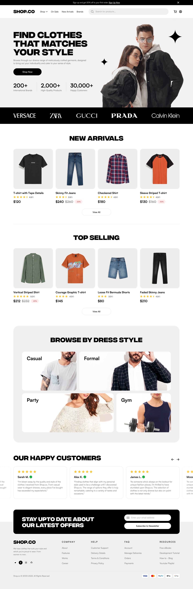
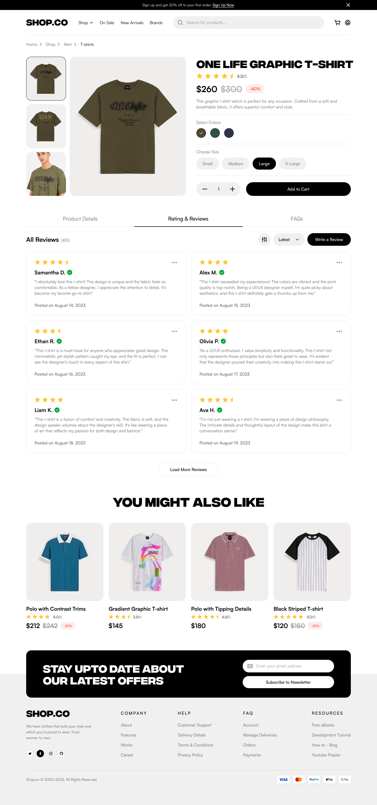

# ShopFusion

ShopFusion is a cutting-edge e-commerce platform inspired by industry leaders like Amazon. Our goal is to deliver a robust, scalable, and user-friendly online shopping experience that caters to guests, registered customers, sellers, and administrators—with seamless mobile integration.

## Overview

This repository houses our comprehensive project documentation, including detailed requirements and design assets. Our design documentation is organized into multiple files:

- **Design Assets Overview:** Please see [Design Assets Overview](docs/design/design-assest.md) for a complete review of our diagrams, wireframes, and other visual assets.
- **Specific Design Files:**
  - **ERD and System Diagrams:** Editable source files (draw.io) along with exported SVG versions.
  - **Wireframes:** Exported as PNG files.
  - **Figma Designs:** Interactive prototypes and additional design iterations are available via the Figma Design Dashboard.

As development evolves, additional directories for our backend, dynamic frontend, tests, and deployment scripts will be added.

### Key Features

- **Guest functionalities:** Browsing and searching products.
- **Customer functionalities:** Account registration, secure login, shopping cart management, checkout, and order tracking.
- **Seller functionalities:** Product listing management and inventory control.
- **Mobile integration:** Responsive design with native features (push notifications, biometric authentication, QR code scanning, offline caching).
- **Administrator functionalities:** User and seller management, product moderation, order oversight, and real-time analytics.

## Design Documentation

Our design assets for ShopFusion are organized within the `docs/design` directory. For a complete overview of our visual design elements—including ERD diagrams, system diagrams, wireframes, and links to Figma prototypes—please refer to the [Design Assets Overview](docs/design/design-assets.md).

### ERD Diagram

- **Editable Source:**  
  [`docs/design/erd/erd.drawio`](docs/design/erd/Database_ER_Diagram.drawio)

- **Exported Version:**  
  

### System Diagram

- **Editable Source:**  
  [`docs/design/system-diagrams/system-diagram.drawio`](docs/design/system-diagrams/System_Architecture_Diagram.drawio)

- **Exported Version:**  
  

## Wireframes

**Homepage Wireframe:**  

**Product Page Wireframe:**  

## Figma Designs

For additional design iterations and interactive prototypes, please refer to our Figma designs:  
[See the Figma Design Dashboard](docs/design/figma/)
