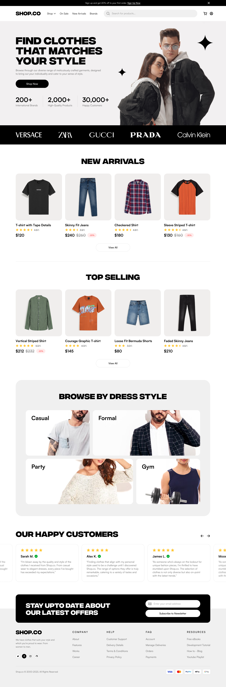

# ShopFusion Design Assets Overview

This document serves as the central reference for all visual design components used in ShopFusion. It outlines the key design assets, their purpose, and where to find them within the repository.

## Contents Overview

- **ERD (Entity Relationship Diagram):**  
  Describes the data model and the relationships between entities.
  - **Editable Source:** [`docs/design/erd/erd.drawio`](./erd/Database_ER_Diagram.drawio)
  - **Exported Version:**  
    
- **System Diagrams:**  
  Illustrates the overall system architecture and how various components connect.
  - **Editable Source:** [`docs/design/system-diagrams/system-diagram.drawio`](./system-diagrams/System_Architecture_Diagram.drawio)
  - **Exported Version:**  
    
- **Wireframes:**  
  Low-fidelity mockups for key pages to visualize layout and user experience.

  - **Homepage Wireframe:**  
    
  - **Product Page Wireframe:**  
    

- **Figma Designs:**  
  For interactive prototypes, please refer to the [Figma Design Dashboard](../figma/figma-designs.md).

## Guidelines for Use

- **Referencing:**  
  Use these assets when making design, development, or architectural decisions. Make sure to verify you’re using the latest exported versions.
- **Updating Assets:**  
  When updating designs, be sure to update both the source (.drawio files) and the corresponding exported versions (.svg or .png).
- **Collaboration:**  
  This document should be reviewed during design meetings to discuss updates, feedback, and future iterations of our design system.

## Additional Notes

For any questions on updating or interpreting these documents, please reach out to the design lead.
